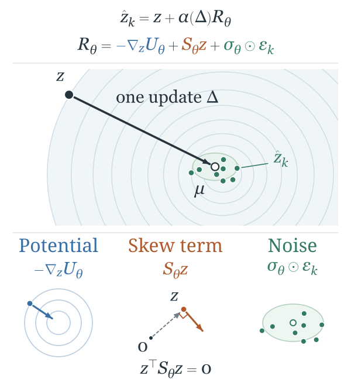

# Chreode

**A Pretrained One-Step Spatial Cell World Model**

Chreode learns population transitions from unpaired cell snapshots. A shared latent
state connects a fixed expression encoder, a Waddington-inspired transition and
task-specific intervention or spatial adapters.

This release accompanies the updated ICLR manuscript. It uses 2,076,478 profiles
from five source collections, with 1,453,534 training profiles and a shared
16,485-gene vocabulary. The collections are ingestion sources, not five independent
studies. Developmental and cytokine data from GSE140802 and data from GSE275562 are
excluded from pretraining.



## Release contents

The versioned manifest in [releases/iclr2027.json](releases/iclr2027.json) pins every
download to a full repository revision and SHA-256 checksum.

| Component | Contents |
|---|---|
| Pretrained model | Fixed 128-dimensional encoder and 28,400-update temporal backbone |
| Temporal adaptation | Weinreb, Veres and ZESTA validation-selected models, three seeds each |
| Intervention | Shared pretrained, scratch and no-action-identity models, three seeds each |
| Spatial | Native 3D Rectangle models with position and mass heads, three seeds |
| Evaluation data | Five benchmark representations, metadata, splits, training-only statistics and original temporal prediction clouds |

Weights are tensor-only state dictionaries. Constructor settings include the
nonpersistent time scales; loading is strict. The Rectangle model is trained from
scratch in native gene coordinates and does not use the pretrained encoder.

Earlier code, configurations and the [published preprint](https://arxiv.org/abs/2605.28111)
remain available. The [legacy release guide](reproduce/legacy-release.md) describes
that older protocol. Its metrics and checkpoints are distinct from this release.

## Install

Install PyTorch for your device, then install from this checkout:

```sh
python -m venv .venv
source .venv/bin/activate
python -m pip install -e .
```

The release validation uses Python 3.10, PyTorch 2.11.0, NumPy 1.26.4,
POT 0.9.6.post1 and GeomLoss 0.2.6. CUDA is optional for inference. The fixed VAE
is a local scVI-inspired PyTorch implementation; loading it does not call
`scvi.model.SCVI.load`.

## Download and predict

```sh
python -m cellworldmodel.script.download_release \
  --manifest releases/iclr2027.json --output artifacts/iclr2027 \
  --model encoder --model dynamics --dataset weinreb
```

```python
import numpy as np
from cellworldmodel.foundation import load_chreode_backbone

model = load_chreode_backbone("artifacts/iclr2027", device="cpu")
states = np.load("artifacts/iclr2027/data/weinreb/representations.npz")["scvi128"]
center = model.predict(states[:16], delta=2.0)          # [16, 128]
samples = model.sample(states[:16], 2.0, k_samples=8, seed=0)
expression = model.decode(center)                     # [16, 16485]
```

`predict` returns the deterministic center. `sample` accepts explicit noise for
replay. Potential gradients require local autograd: use `torch.no_grad()`, not
`torch.inference_mode()`.

For expression input, align mapped counts to
[artifacts/gene_vocab.parquet](artifacts/gene_vocab.parquet) in `canonical_index`
order and zero-fill absent genes. Preserve the recorded mapping's collision policy.
`model.encode(counts)` performs total-count normalization to 10,000 and `log1p`.
Already transformed input requires `input_transform="legacy-as-is"`.

## Adapted models

Download the desired model IDs from the manifest, then load one directly:

```python
from cellworldmodel.foundation.released import load_released_model

dynamics = load_released_model("artifacts/iclr2027", "weinreb_seed0")
# dynamics(z, delta, epsilon) -> [cells, samples, 128]

intervention = load_released_model("artifacts/iclr2027", "cytokine_chreode_tuned_seed0")
# intervention(z, delta, epsilon, condition_ids)
print(intervention.condition_to_id)
```

Intervention checkpoints contain both the adapted base and the external adapter.
The no-identity models automatically map all requested conditions to their trained
shared slot. An action may shift the state even at zero horizon; the zero-horizon
identity guarantee applies to the unconditioned dynamics.

Rectangle uses `cellworldmodel.model.rectangle.RectangleData` and
`RectangleTransition`. Its source-neighborhood construction uses only the
current source split, with 16 nearest neighbors and known simulated alignment.

## Evaluation and training

Main temporal results use exact full-latent Wasserstein distance after training-only
standardization, with equal weighting of target times and sample SD over three
training seeds:

| Method | Weinreb W2 (lower) | Veres W2 (lower) | ZESTA W2 (lower) |
|---|---:|---:|---:|
| Chreode pretrained | 5.1580 +/- 0.0258 | 6.3686 +/- 0.0396 | 7.2536 +/- 0.1356 |
| Chreode scratch | 5.1785 +/- 0.0535 | 6.6552 +/- 0.0460 | 8.5126 +/- 0.5974 |

Training and validation transport losses are distinct from the exact test solver.
Temporal pretraining uses the recorded fixed-iteration transport objective;
current adaptation uses a debiased Sinkhorn divergence. Intervention training
uses transport plus MMD, both with weight 1. Rectangle uses its joint
gene-position-mass objective.

Current training entry points are `cellworldmodel.script.run_foundation` and
`cellworldmodel.script.run_intermediate_eval`. Use an editable Git checkout
for training provenance. Installed wheels and anonymous source archives support
inference; training entry points currently require Git metadata.
[Current reproduction instructions](reproduce/iclr2027.md) state the supported
commands, model selection and evaluation scope.

## License and provenance

Code is MIT-licensed; see [LICENSE](LICENSE). Source datasets retain their own
licenses and accession requirements. Released representations preserve numerical
arrays and row order; their manifests retain source hashes while removing private
filesystem paths. A source checkpoint fingerprint identifies the original
encoder; the downloadable tensor-only checkpoint has a separate file checksum.

Contributions follow [AGENTS.md](AGENTS.md) and the
[research evidence policy](docs/research-governance/policy.md).
